# LR6
## Лабораторная работа №6
### Выполнил студент группы 4916 Алексей Шихотов
### Ход работы:

На сайте GitHub выполнил форк https://github.com/Kurtyanik/LR6/
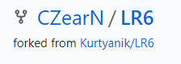
Далее я произвёл установку в config имя пользователя и его почту.
Однако в следствии последующих ошибок в программном обеспечении компьютера данные изменения не были зафиксированы.
Также, мне пришлось перейти в Git Bash для дальнейшего выполнения лабораторной работы.
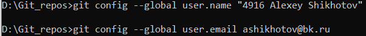
После я перешёл в созданную мной папку и использовал команду git init чтобы инициализировать гит в данной папке.
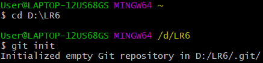
Командой git remote add origin связал папку с удалённым репозиторием на сайте GitHub
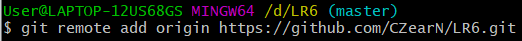
С помощью команды git clone клонировал проект в свою папку.
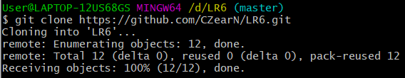
Далее я создал новый файл и закоммитил его в master. Поскольку я не вводил комментарий и описание, то GitHub их создал автоматически.
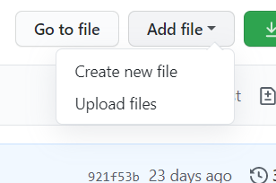
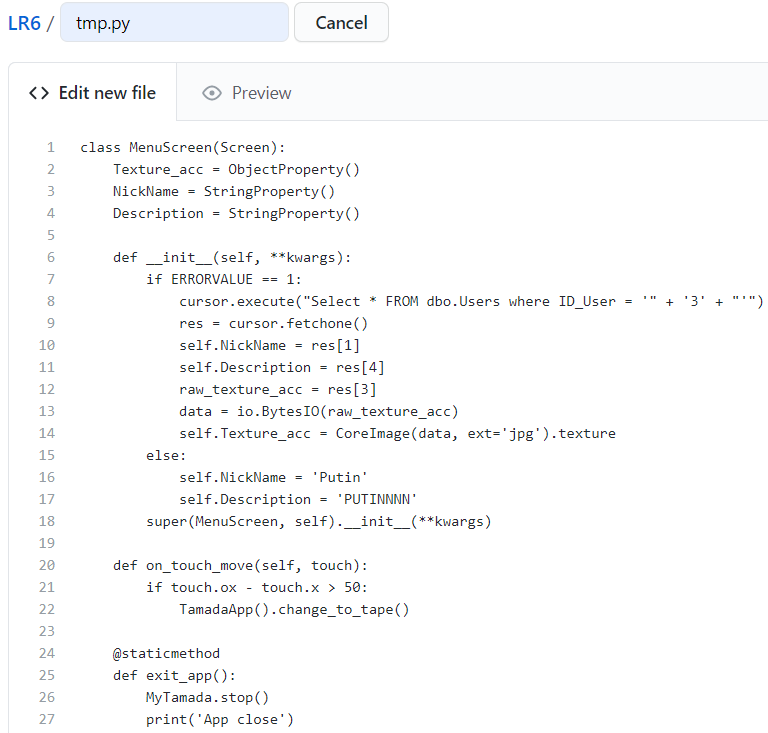
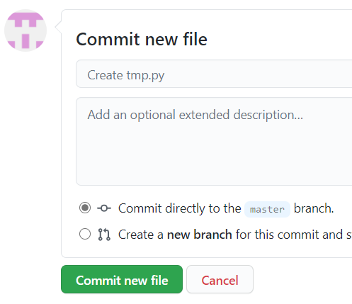
Затем я подтянул изменения в локальный master и с помощью команды git log получил список операций.
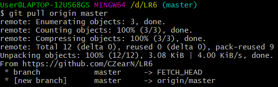
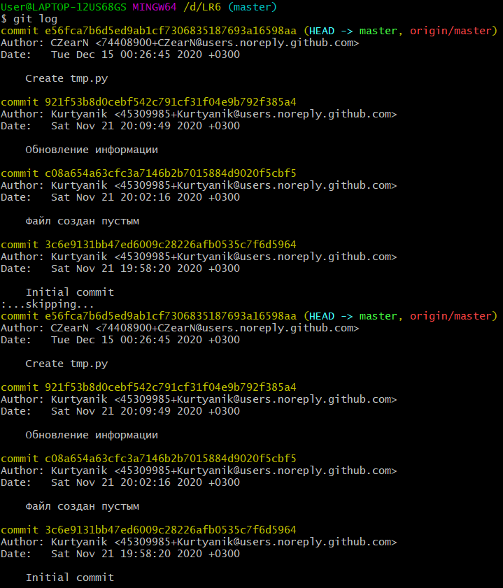
После я помощью команды git show открыл подробности последнего коммита.
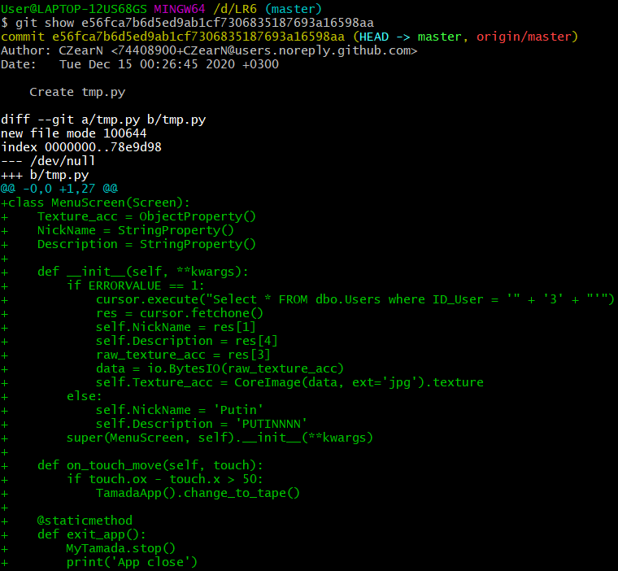
Далее я переключился на ветку branch1 и попытался выполнить слияние.
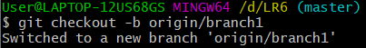
Однако не получилось из-за конфликта в файле.
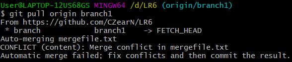
Вручную открыв и справив конфликт, я исправил ошибку.
Затем я подготовил файл к коммиту по средством команды git add и закоммитил его. После повторил операцию.
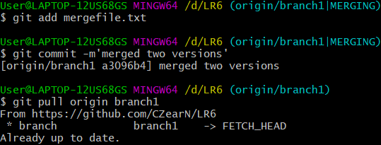
После я заканчиваю слияние веток.
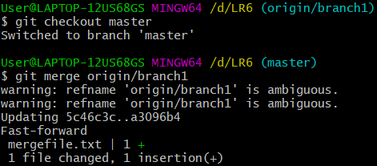
Следующим шагом было удаление ветки branch1.
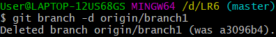
Затем я запушил все изменения в удалённый master.
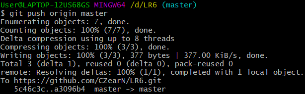
Далее я добавил несколько изменений в удалённый мастер по средством добавления нескольких файлов.
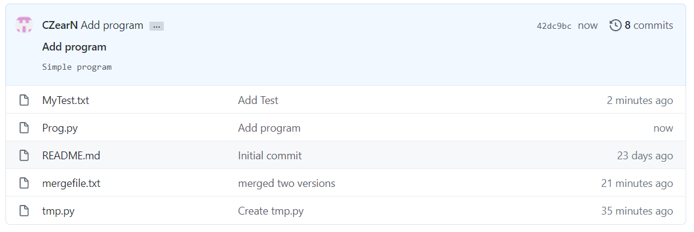
И затем подгрузил изменения в локальный мастер.

После выполнил git log для показа последний коммитов.
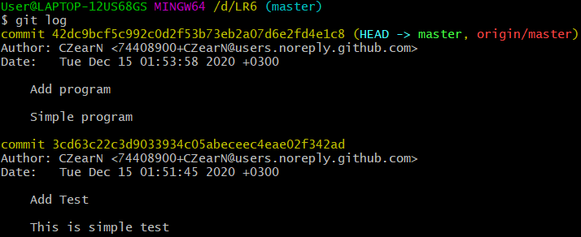
А затем я выполнил откат к предыдущему коммиту с помощью команды git reset --hard HEAD~1.
Ниже HEAD указывает на текущий коммит.
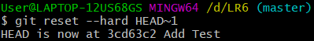
Далее запушил обновлённую ветку.
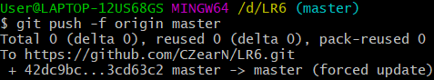
Затем я приступил к созданию новой ветки для отчёта. Выполнив команду git checkout -b я создал ветку otchet.
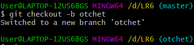
После я подтянул в ветку изменения из удалённого master и выполнил git log --graph для визуализации веток и коммитов в виде графов.
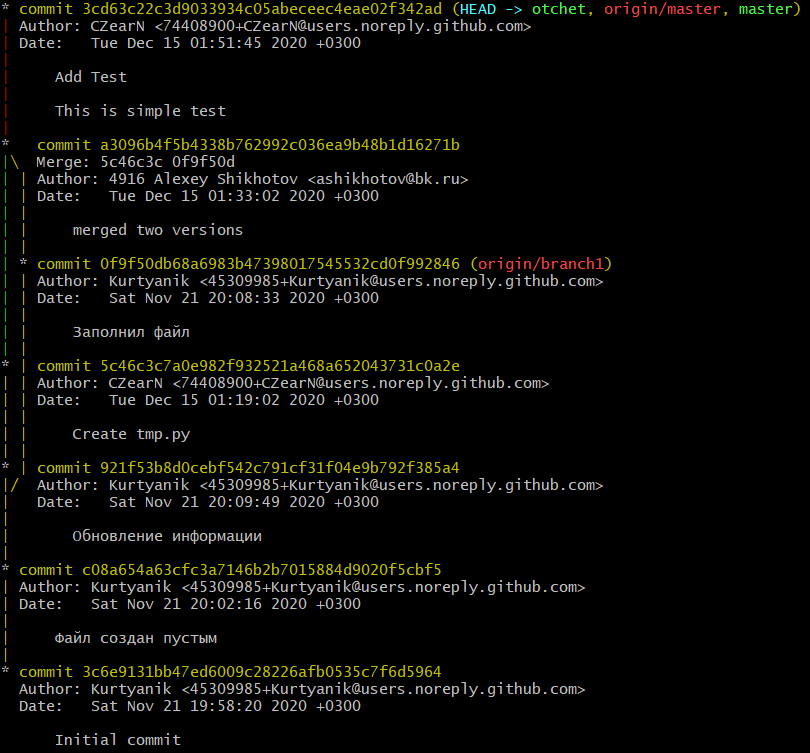
Далее я выболнил подготовку к коммиту скриншоты и создал коммит.
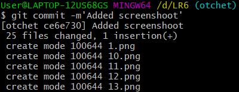
После чего запушил изменения в удалённый otchet.
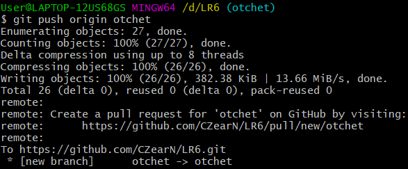
Финальный скрин списка операций.
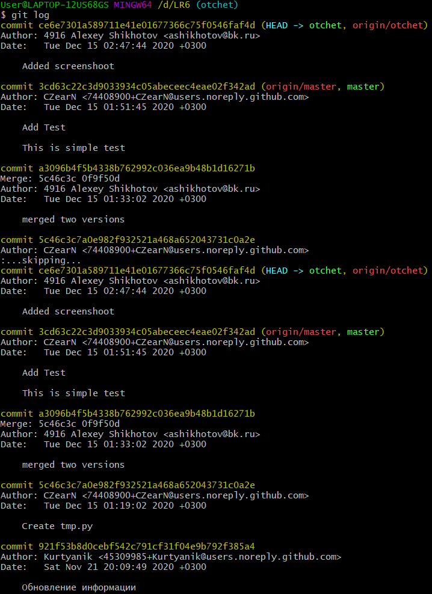
Отчёт оформлен в файле README.md
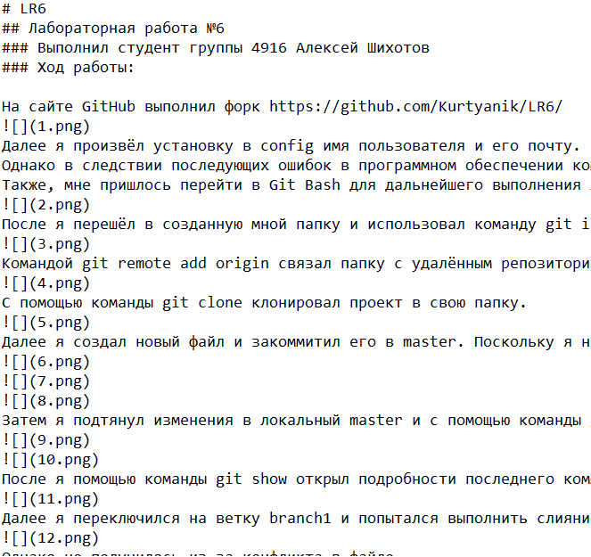